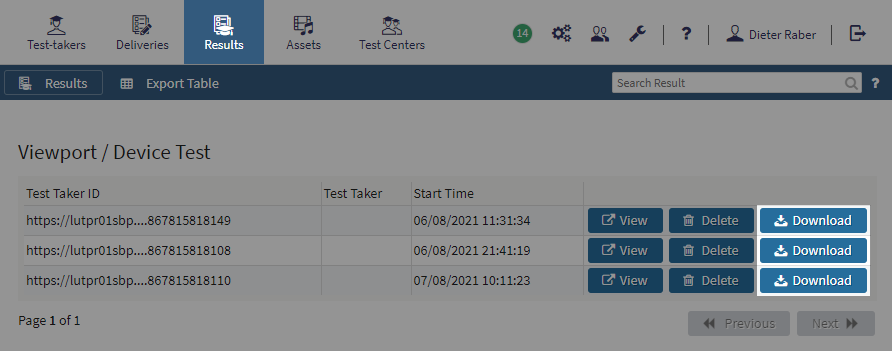

# TAO System requirements


## To Do
Further down the document describes the final outcome but before that some things need to be done. If you complete any of these tasks please remove them from the list.

### Code review
The code in this project has not been reviewed yet.

### Viewports and Devices
- A PCI needs to be created, see [developer-readme.md](/src/pci/developer-readme.md) for more information. Work is pending.
- The first item in [TAO Standard Viewport and Device Test](assets/test/tao-vd-test.zip) needs to be replaced by one that uses the PCI
- Using this test and updating this repo needs to be made part of the release process
- Some projects already use https://github.com/oat-sa/browserslist-app-tao. They will need to migrate to this repo. It needs to be clarified with Client Diagnostics if they already use the browser list and if they don't, they should.

### Downloads
- Work for a Docker pilot as well as for regular Docker releases is underway, but not finished yet. 
- `data/downloads.json` needs to be reviewed and corrected. The data under `virtualized.hosts` are correct but those under `virtualized.containers` and `source` are only guesses for now. Depends on the above.

### Server 
- `data/server.json` needs to be reviewed.

### WordPress Plugin
- The two URLs in `src/implementations/wordpress-plugin/tao-system-requirements/tao-system-requirements.php` need to be updated
- The Plugin needs to be redeployed

### Release Process
Updating this repo must be made part of the release process

### Homepage
- GH Page needs to be created


_End of todo list, final outcome starts below_

---

## Homepage


https://oat-sa.github.io/tao-system-requirements

### API 
A simple REST API is available.

- Latest version, combined: [/build/api/system-requirements-latest.json](https://oat-sa.github.io/tao-system-requirements/build/api/system-requirements-latest.json)
- Latest version, browsers only: [/build/api/browsers-latest.json](https://oat-sa.github.io/tao-system-requirements/build/api/browsers-latest.json)  
- Latest version, server side only: [/build/api/server-latest.json](https://oat-sa.github.io/tao-system-requirements/build/api/server-latest.json)  
- Latest version, viewports and devices only: [/build/api/viewportDevices-latest.json](https://oat-sa.github.io/tao-system-requirements/build/api/viewportDevices-latest.json)

You can also retrieve data for a particular release by replacing `-latest.json` with `-{release}.json`, data is kept for the two past releases. 

### Assets 


Download the [TAO Standard Viewport and Device Test](assets/test/tao-vd-test.zip).

Download the [PCI](assets/pci/taoenvinfo.zip) to create your own test. If you want to implement a similar system you are probably mostly interested in [/data-provider/viewport-devices.js](data-provider/viewport-devices.js).

If you want to use the styles from the website, the stylesheet including all icons is available at [/build/css/main.css](build/css/main.css). You can also use `/src/scss` as a base for your own flavor.

---

### Updating the repository
The repository needs to be updated with every TAO Community Release.

Update your local copy of the repository:

```bash 
git pull origin develop
```

If you have no local copy yet, clone the repository first:

```bash
git clone https://github.com/oat-sa/tao-system-requirements.git
git checkout develop
```

#### Updating the browser database and the versions of TAO, Server, Database or Docker
Mind you that _Docker_ refers to the command only, not the actual Docker version of TAO!

```bash
npm run update
```
Edit `/data/server.json` manually in case to add or remove a component. 

The browser db and the server side components (incl. the Docker command) can be updated separately with:
```bash
npm run update:browsers
npm run update:components
```

#### Updating viewports and devices

1. Download the [TAO Standard Viewport and Device Test](assets/test/tao-vd-test.zip). 
2. Run the test on at least one mobile device, ideally on a ~7″ screen in landscape mode.
3. In your TAO instance download the results from the tests and copy them to `/data/viewport-devices`. Older data will be deleted automatically during the build process. 

#### Commit your changes
If you perform only some of the above tasks it is important to commit and push your changes to the repository.
```bash
git add -A
git commit -m "version updated to 1.2.3" # or "test results for 1.2.3"
git push origin develop
``` 

#### Rebuild the website and the APIs
Once everything is up-to-date you need to rebuild the website and the APIs and update the repository. If you aren't sure if all data are at the right version, don't worry - the build will then halt and show a comprehensive status report.

```bash
npm run build
git add -A
git commit -m "rebuilt API for 1.2.3"
git push origin develop
```

Finally create a pull request to `main` and merge your changes.

---
#### Deploying the WordPress plugin
There is an implementation that uses the API in the form of a WordPress Plugin under `src/implementations/wordpress-plugin`. This plugin is complete and working but if you modify it for any reason you will need to deploy it with any of the following two commands:
```bash 
php ./src/implementations/wordpress-plugin/tao-system-requirements/deploy.php
# or
npm run deploy:wp-plugin
``` 
This zips the plugin and moves the resulting archive to `build/wordpress-plugin/tao-system-requirements.zip` where it will be discovered by WordPress.

For more details on the plugin refer to [the respective readme](src/implementations/wordpress-plugin/tao-system-requirements/readme.md).
